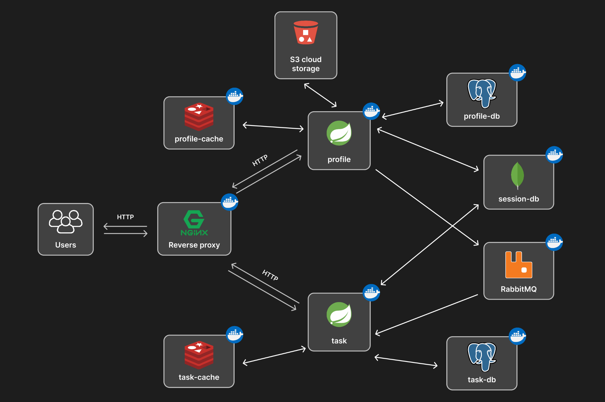

# task-tracker
Проект представляет собой систему, состоящую из двух микросервисов для управления задач связанных с пользователем, с разделением пользователей по ролям. На данные момент проект находится **в разработке** и будет дополняться.


## Архитектура
Проект состоит из 2 микросервисов **profile** и **task**:


### profile 
Отвечает за управление профилем пользователя и аутентификацию. Этот сервис использует **Spring Security** для аутентификации и авторизации пользователей. В системе есть две роли пользователей:

* **User:** обычный пользователь, который может управлять только своим профилем.
* **Admin:** администратор, который может управлять профилями всех пользователей.

При удалении профиля пользователя **profile** отправляет сообщение для сервиса **task** через **RabbitMQ**, чтобы второй сервис удалил все задачи и подзадачи, созданные этим пользователем.

#### Основные функции:

* Регистрация и аутентификация пользователей через **Spring Security**.
* Управление профилем пользователя (редактирование данных, пароля и т.д.).
* Уведомление сервиса **task** о удалении профиля для удаления всех связанных задач через **RabbitMQ**.
* Роли:
    - **User** — может управлять только своим профилем.
    - **Admin** — может управлять всеми профилями пользователей, включая их удаление.

### task
Управляет задачами и подзадачами пользователей. Этот сервис также использует **Spring Security** для аутентификации и авторизации, проверяя, что пользователь имеет доступ только к своим задачам. Каждая задача связана с конкретным пользователем — её создателем.

#### Основные функции:

* Создание, редактирование, удаление задач и подзадач.
* Задачи привязаны к пользователю, который их создал.
* Получение сообщений через **RabbitMQ** о необходимости удалить все задачи, связанные с удалённым профилем пользователя.
* Роли:
    - **User** — может работать только с собственными задачами.
    - **Admin** — может управлять задачами всех пользователей, включая удаление задач других пользователей.


## Технологии
Проект использует следующие технологии:
* [JDK 17](https://openjdk.org/projects/jdk/17/) - основная версия Java для разработки
* [Gradle](https://gradle.org/) - инструмент автоматизации сборки
* [PostgreSQL](https://www.postgresql.org/) - SQL база данных 
* [MongoDB](https://www.mongodb.com/) - NoSQL база данных
* [RabbitMQ](https://www.rabbitmq.com/) - брокер сообщений
* [Git](https://git-scm.com/) - система контроля версий
* [Docker](https://www.docker.com/) - используется для контейнеризации всех компонентов проекта


## Зависимости
Зависимости которые используются в проекте.

Для **profile** и **task**:
- [Spring Web](https://docs.spring.io/spring-boot/reference/web/index.html) - Для создания RESTful веб-приложения с помощью Spring MVC. Использует Apache Tomcat в качестве встроенного контейнера по умолчанию.
- [Spring for RabbitMQ](https://docs.spring.io/spring-amqp/reference/) - Предоставляет общую платформу для отправки и получения сообщений между сервисами.
- [Spring Data JPA](https://docs.spring.io/spring-data/jpa/reference/) - Хранение данных в SQL бд. 
- [Spring Data MongoDB](https://docs.spring.io/spring-data/mongodb/reference/) - Хранение данных в NoSQL бд.
- [PostgreSQL Driver](https://jdbc.postgresql.org/) - Драйвер JDBC и R2DBC, который позволяет программам Java подключаться к базе данных PostgreSQL.
- [Spring Security](https://docs.spring.io/spring-security/reference/) - Настраиваемая среда аутентификации и контроля доступа для приложений Spring
- [Spring Session](https://docs.spring.io/spring-session/reference/) - Предоставляет API и реализации для управления информацией о сеансе пользователя.
- [Lombok](https://projectlombok.org/) - Библиотека аннотаций Java, которая помогает сократить шаблонный код.


## Использование
Этот пример поможет вам быстро начать работу с проектом.

### Предварительное условие
Перед тем, как начать использовать проект, убедитесь, что у вас установлены следующие инструменты:
* Docker
* Docker Compose

### Запуск проекта
Для того чтобы развернуть проект на своем локальном окружении, выполните следующие шаги:
1. Склонируйте репозиторий:

    ```bash 
    git clone https://github.com/xujxxs/task-tracker.git
    ```

2. Перейдите в каталог проекта:

    ```bash
    cd task-tracker
    ```

3. Соберите и запустите проект с помощью Docker Compose: 

    ```bash 
    docker compose up -d --build
    ```

4. Сервер будет доступен по адресу: http://localhost:80

### Документация
На данный момент документация отсутствует.


## Дорожная карта
- [x] Сделать **profile** сервис
- [x] Сделать **task** сервис
- [x] Написать **nginx.conf** и **docker-compose.yaml** файлы
- [x] Добавить **RabbitMQ** для межсервисного взаимодействия
- [x] Добавить скрипты авто конфигураций **init-scripts**
- [x] Сделать **README.md**
- [] Добавить кеширование с помощью **Redis**
- [] Добавить хранение файлов для сервиса **profile** в облако
- [] Сделать **notification** сервис
- [] Добавить **SSL/TLS**
- [] Добавить **ELK** для подробного мониторинга
- [] Написать документацию


## Лицензия
Распространяется по **MIT** лицензии. См. **LICENSE.txt** для получения дополнительной информации.


## Контакты
**Telegram:** [@xujxxs](https://t.me/x_ujxxs)